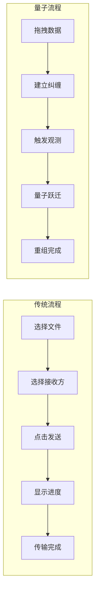

# 量子跃迁用户体验设计

## 核心体验原则

### 1. 观测者体验 (Observer Experience)
> "你的确认，就是传输的完成"

- **传统**：发送 → 传输 → 接收 → 确认
- **量子**：观测 → 跃迁 → 完成（观测即完成）

### 2. 无时间感 (Timeless Experience)
> "没有等待，只有瞬间"

- 消除进度条和等待动画
- 用量子态变化替代传输状态
- 即时反馈，即时完成

### 3. 无空间感 (Spaceless Experience)
> "没有距离，只有关联"

- 消除"发送到"的概念
- 强调"出现在"的体验
- 设备间天然相连的感觉

## 交互流程设计

### 传统流程 vs 量子流程



## 界面设计元素

### 1. 量子态可视化

#### 数据准备阶段
```
🌀 量子云凝聚
显示数据以概率云形式聚集
颜色：深蓝 → 量子蓝 → 亮蓝
```

#### 传输触发阶段
```
⚡ 量子隧穿动画
显示数据穿越障碍的动画
特效：光子流、时空扭曲
```

#### 完成阶段
```
✨ 量子态坍缩
显示波函数坍缩为实体
效果：星光闪烁、能量收敛
```

### 2. 状态语言设计

#### 传统状态 vs 量子状态

| 传统状态 | 量子状态 | 视觉表现 |
|---------|---------|---------|
| "发送中" | "量子态演化中" | 波函数动画 |
| "接收中" | "量子隧穿中" | 光子穿越效果 |
| "完成" | "观测到量子态" | 星光闪烁 |

### 3. 交互反馈设计

#### 触觉反馈
- **纠缠建立**：轻微震动表示设备关联
- **量子跃迁**：强烈震动表示状态转移
- **完成确认**：渐弱震动表示重组完成

#### 听觉反馈
- **量子准备**：低频共振声
- **状态跃迁**：高频穿透声
- **完成确认**：和谐共鸣声

## 动作语言设计

### 传统动作 vs 量子动作

| 传统动作 | 量子动作 | 含义 |
|---------|---------|------|
| 发送 | 投射 | 数据被引导到另一端 |
| 接收 | 观测 | 通过观测完成状态坍缩 |
| 上传 | 折叠 | 空间被压缩折叠 |
| 下载 | 展开 | 数据在本地重组 |

### 状态提示语

#### 准备阶段
- "正在建立量子纠缠"
- "数据处于叠加态"
- "准备量子跃迁"

#### 传输阶段
- "量子隧穿中"
- "波函数演化中"
- "状态转移中"

#### 完成阶段
- "观测到量子态"
- "数据重组完成"
- "纠缠态解除"

## 多设备体验

### 设备发现
```
传统：搜索设备 → 选择目标 → 建立连接
量子：天然相连 → 量子感应 → 自动关联
```

### 传输过程
```
传统：进度条显示传输百分比
量子：量子云显示状态演化
```

### 完成反馈
```
传统：弹窗提示传输完成
量子：环境光效变化表示完成
```

## 错误处理的量子表达

### 网络错误
- **传统**："网络连接失败，请重试"
- **量子**："量子纠缠中断，正在重新建立"

### 传输失败
- **传统**："传输失败，请重新发送"
- **量子**："量子态退相干，正在重新准备"

### 设备离线
- **传统**："设备不在线"
- **量子**："量子纠缠消失"

## 设置与配置

### 量子参数设置
- **纠缠强度**：设备关联的紧密程度
- **跃迁模式**：直连/中继/延迟容忍
- **观测灵敏度**：触发传输的条件

### 隐私与安全
- **量子加密**：端到端加密设置
- **纠缠管理**：设备关联管理
- **状态重置**：量子态清理

## 教育与引导

### 量子概念引导
```
1. 什么是量子跃迁？
   - 数据的瞬间移动
   - 无视距离的传输

2. 如何使用量子传输？
   - 拖拽即传输
   - 观测即完成

3. 量子传输安全吗？
   - 量子物理保证安全
   - 任何观测都会被发现
```

### 交互教程
- **量子准备**：如何建立纠缠
- **量子传输**：如何触发跃迁
- **量子测量**：如何完成观测

## 未来体验展望

### AR/VR集成
- 量子云的3D可视化
- 纠缠态的空间展示
- 跃迁过程的沉浸式体验

### 脑机接口
- 意念触发量子跃迁
- 直接观测量子态
- 思维级别的传输

### 环境融合
- 智能家居的量子联动
- 环境光效的量子响应
- 空间感知的量子增强

---

**核心理念**：我们将量子物理的奇妙现象转化为直观的用户体验，让用户感受到科技的魔力，同时保持操作的 simplicity。